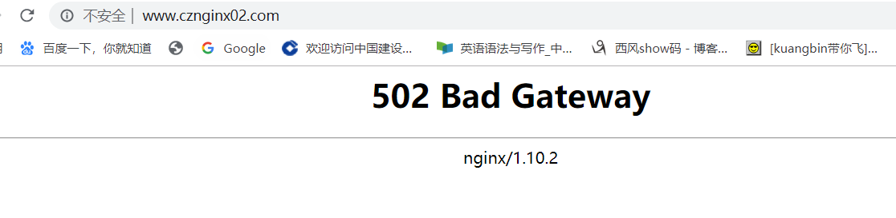
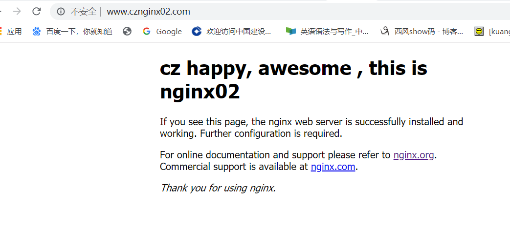

# Nginx高级应用
## 配置和实验反向代理
- 配置反向代理服务器的nginx.conf
```bash
#声明两个upstream 反向代理后端服务器
    upstream nginx01{
        server 118.89.236.4:8081;
    }
    upstream nginx02{
        server 118.89.236.4:8082;
    }
  
  # 代理服务器80端口设定监听和反向代理
    server {
        listen       80;
        server_name  www.cznginx01.com;
        location / {
            proxy_pass              http://nginx01;
        }
    }
    server{
        listen 80;
        server_name www.cznginx02.com;
        location / {
            proxy_pass              http://nginx02;
        }
    }
 ```
 
 - 配置后端服务器的nginx.conf
 
 ```bash
        server{
                listen 8081;
                server_name nginx8081.com;
                root html/nginx01;
                index index.html index.htm; 
        }
        server{
                listen 8082;
                server_name nginx8082.com;
                root html/nginx01;
                index index.html index.htm;
        }
```

- 在本机（Windows）配置hosts

```
#服务器域名解析
118.89.236.4 www.cznginx01.com
118.89.236.4 www.cznginx02.com
118.89.236.4 www.cznginx.com
```

- 实验结果  
  - 报错,502

    
  - 访问8082端口失败，查看error.log日志  
  
  - 排除upstream的语法错误，开启防火墙8082端口的权限  
  
  - 成功结果 


    

    

***

## 配置和实验rewrite 以及 redirect
- rewrite和redirect的区别
  - 关于重定向
    - 通过重定向，浏览器知道页面位置发生变化，从而改变地址栏显示的地址。
    - 通过重定向，搜索引擎意识到页面被移动了，从而更新搜索引擎索引，将原来失效的链接从搜索结果中移除
    - 临时重定向(R=302)和永久重定向(R=301)都是亲搜索引擎的，是SEO的重要技术。

    - Redirect是浏览器和服务器发生两次请求，也就是服务器命令客户端“去访问某个页面”；

    - redirect的URL需要传送到客户端。

    - redirect是从一个地址跳转到另一个地址。

  - 关于重写

    - rewrite的URL只是在服务器端

    - Rewrite则是服务器内部的一个接管，在服务器内部告诉“某个页面请帮我处理这个用户的请求”，浏览器和服务器只发生一次交互，浏览器不知道是该页面做的响应，浏览器只是向服务器发出一个请求。

    - URL重写用于将页面映射到本站另一页面，**若重写到另一网络主机（域名），则按重定向处理**。

    - rewrite是把一个地址重写成另一个地址。地址栏不跳转。相当于给另一个地址加了一个别名一样。

- 上述的例子就像用户去买手机，缺货时的两种处理：让用户自己去其他地方买（Redirect）；公司从其他的地方调货（Rewrite）。

- redirect和rewrite操作

```bash
 server{
        listen 8081;
        server_name 118.89.236.4;
        root html/nginx01;

#  重定向日志以notice级别输出到error.log
    rewrite_log on;
    error_log /usr/local/nginx/logs/error.log notice;

#       地址重写
        location / {
                if (!-f $request_filename){

                        rewrite ^/test1/(.*)$ http://www.baidu.com;
                }
                rewrite ^/test2/(.*)$  /test/index.html;
        }
#  302重定向 临时重定向
        location = /redirect {
                    return 302 http://www.baidu.com;
        }
#  301重定向 永久重定向
        location = /redir {
                return 301  http://118.89.236.4/test/index.html;
        }
#  alias别名
        location /newweb {
                alias /usr/local/nginx/html/nginx01/test/;
        }

            #防盗链
        location ~* \.(gif|jpg|png|swf|flv)$ {
                valid_referers none blocked 118.89.236.4;
                if ($invalid_referer) {
                        return 403;
                }
        }

    }

```
- 对nginx01进行地址重写rewrite操作 如果文件不存在，且第一个参数匹配test2，则跳到test/index.html，如果文件存在，跳到该文件。

    
    - 重定向日志

    

- 对nginx01进行地址重写redirect操作

  - 临时重定向

    

  - 永久重定向

    

- 配置别名alias

    

- 配置防盗链
  - 设置页面下图片

    

  - 配置防盗链  
    - 非法  
    

    - 合法  
    

*** 

## 配置负载均衡

```bash
//把两个upstream合而为一，设置权重
    upstream nginxproxy{
        server 118.89.236.4:8081 weight=1 ;
        server 118.89.236.4:8082 weight=2 ;
    }
    server{
        listen 80;
        server_name www.cznginx.com;
        location / {
                proxy_pass http://nginxproxy;
        }
    }
```

- 发现
>配置后每刷新三次，有两次访问到nginx02，一次nginx01，说明该权重设置并不是按概率随机的，而是通过计数器计数的方式决定下一次访问哪一个后端主机的

- 结合负载均衡算法
- 首先测定ip_hash,本机访问服务器时，被锁定在了nginx04

    ```bash
    upstream nginxproxy{
       #least_conn;
        ip_hash;
        server 118.89.236.4:8081 weight=1 ;
        server 118.89.236.4:8082 weight=20 ;
        server 118.89.236.4:8083 weight=3;
        server 118.89.236.4:8084 weight=44;
        # max_fails=3 fail_timeout=10s;
    }
    ```
- ip_hash和least_conn同用，冲突
- least_conn与weight配合使用,发现并没有什么大用，还是根据权重来，应该是客户端太少了(2台)，而tcp又是长连接，所以相当于每个虚拟主机都连了2个客户端，因此真正起作用的就是weight了。

    ```bash
    upstream nginxproxy{
        least_conn;
        server 118.89.236.4:8081 weight=1 ;
        server 118.89.236.4:8082 weight=2 ;
        server 118.89.236.4:8083 weight=3;
        server 118.89.236.4:8084 weight=4 max_fails=3 fail_timeout=10s;
    }
    ```
***
## 配置nginx实现动静分离
- 基本思路
  - 静态文件如jpg png html 等代理到提供静态资源的后端服务器
  - 动态文件如jsp php 等代理到提供动态资源的后端服务器
- 配置文件
```bash
    server{
        listen 80;
        server_name www.cznginx.com;
        location / {
                proxy_pass http://nginxproxy;
        }
        location ~ .*.(gif|jpg|png|bmp|swf|css|js|html|htm) {
                proxy_pass http://nginx01;
        }
        location ~ .*.(php|asp|jsp|cgi|perl) {
                proxy_pass http://nginx02;
        }
    }

```
- 安装php-fpm运行php动态文件
    - 安装 `yum install php php-mysql php-fpm`
    - 启动 `systemctl start php-fpm`
    - 在动态服务器server模块添加

    ```bash
     location ~ \.php$ {
        try_files $uri =404;
        fastcgi_pass unix:/var/run/php/php-fpm/php-fpm.sock;
        fastcgi_index index.php;
        fastcgi_param SCRIPT_FILENAME $document_root$fastcgi_script_name;
        include fastcgi_params;
    }
    ```
- 访问动态服务器失败，报错502Bad gateway
  - 首先排除防火墙问题，关闭防火墙仍然无效
  - 查看错误日志error.log

    
  - 找到错误，php-fpm.sock路径不正确，找到本机该文件路径/var/run/php-fpm/php-fpm.sock;修改重启服务即可

- 结果
  - 访问静态资源

    
  - 访问动态资源

    

  - 注：这两种资源不在同一个后端服务器上，但是通过正则表达式识别url参数可以代理到相应的后端服务器进行请求。


***
## 配置keepalived，实验和观察节点掉线和上线情况。
- keepalived安装 
  - `yum -y install keepalived`

- 实验架构图  

    

- 在两台结点都修改keepalived的配置文件，下面是备机的keepalived.conf,主机不用改

```bash
! Configuration File for keepalived

global_defs {
   notification_email {
     acassen@firewall.loc
     failover@firewall.loc
     sysadmin@firewall.loc
   }
   notification_email_from Alexandre.Cassen@firewall.loc
   smtp_server 192.168.200.1
   smtp_connect_timeout 30
   router_id LVS_02 # server id 要改 唯一性
   vrrp_skip_check_adv_addr
   vrrp_strict
   vrrp_garp_interval 0
   vrrp_gna_interval 0
}

vrrp_instance VI_1 {
    state BACKUP # 角色要改
    interface enp0s8 #根据自己本机的网络接口，有的是eth0
    virtual_router_id 51
    priority 80 #优先级小
    advert_int 1
    authentication {
        auth_type PASS
        auth_pass 1112
    }
    virtual_ipaddress {
        192.168.56.118/24 #自己设定VIP
    }
}

```

- 实验结果
  - 第一次实验，失败，主备机都存在虚拟IP，怀疑二者不能互通，应该是防火墙的问题，开启vrrp协议

    ```bash
    firewall-cmd --direct --permanent --add-rule ipv4 filter INPUT 0  --protocol vrrp -j ACCEP

    firewall-cmd --reload
    ```
  - 第二次实验成功，结点1，2都开启keepalived，使用ip a查看网卡enp0s8时只能在主机MASTER看到虚拟IP 192.68.56.118,关闭主机，在备机上ip a,立刻能查看到虚拟IP 192.68.56.118 
  - 主备正常情况

    

  - 主机MASTER宕机,备机接管

    

***
## 实验参考
- [安装nginx php](https://www.digitalocean.com/community/tutorials/how-to-install-linux-nginx-mysql-php-lemp-stack-on-centos-7)
- [centos7防火墙操作](https://www.tecmint.com/install-configure-firewalld-in-centos-ubuntu/)
- [keepalived 操作](https://klionsec.github.io/2017/12/23/keepalived-nginx/)
- [rewrite和redirect](https://weblogs.asp.net/owscott/rewrite-vs-redirect-what-s-the-difference)
- [yum 使用](https://www.tecmint.com/20-linux-yum-yellowdog-updater-modified-commands-for-package-mangement/)
- [centos7配置网卡](https://www.serverlab.ca/tutorials/linux/administration-linux/how-to-configure-centos-7-network-settings/)